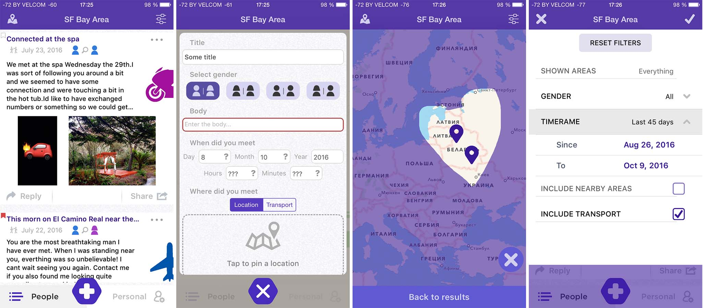

## Redity
# Description
Redity - iOS client app for looking for missed connections. Works with java-powered web server.
Currently under development
# Features
* Browse latest missed connections by geo regions
* Chat with authors of posts
* Easily add your own missed connection, attach photos and geo location
* Limit missed connections list by applying comprehensive filters
# Screenshots

# Development techniques
* Swift, UIKit, JSQMessagesViewController
* Implemented caching approach which works with both images and map snapshots
* Devised system of embedded geo regions, which allows to strictly sort posts by specified geo polygon
* Made use of QuadTree to make geo search fast
